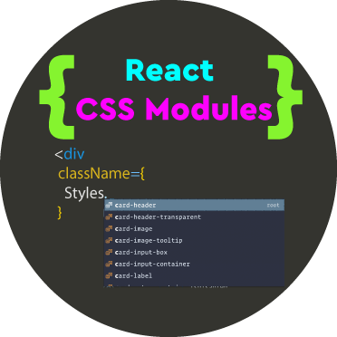
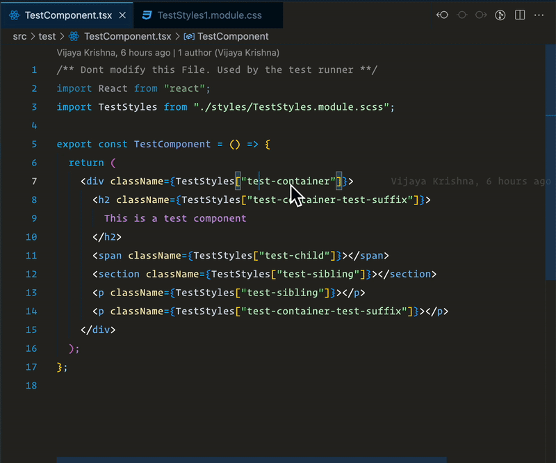
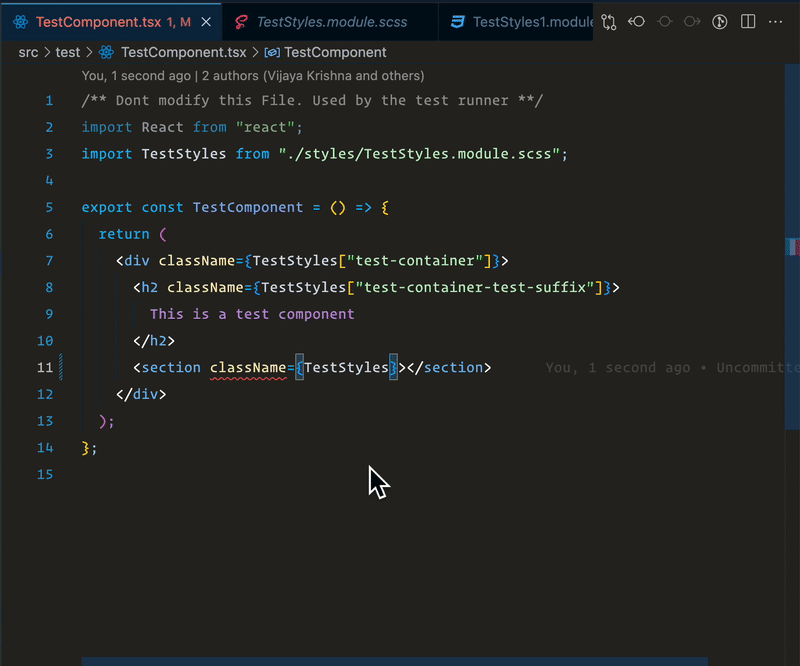

# React CSS modules



VS Code extenstion that enables CSS modules support for your React projects written in typescript.

Currently supports CSS and SCSS modules with the following capabilities

- [Definitions](https://code.visualstudio.com/api/references/vscode-api#DefinitionProvider)

  - Root selectors
  - Nested Selectors
  - Suffixed Selectors([scss only](https://sass-lang.com/documentation/style-rules/parent-selector#adding-suffixes))

  - 

- [Hover](https://code.visualstudio.com/api/references/vscode-api#HoverProvider)

  - Peek properties on hover

  - 

- [Completions](https://code.visualstudio.com/api/references/vscode-api#HoverProvider)

  - Completion of all types of selectors

  - 

## Settings

Defaults

```json
{
  "reactTsCSS.peek": true,
  "reactTsCSS.autoComplete": true,
  "reactTsCSS.definition": true
}
```

## Current Feasibilities

1. This extension assumes your project uses CSS/SCSS modules in typescript.
2. The extension currently supports String literals as selector identifiers.This enables usage of camel case and kebab case . Currently the completions are resolved as string literals. This is due to the fact that its a good practice to write class names in kebab case
3. In order for the features to work smoothly, the selectors must have a reference to a CSS module.
4. The extension Supports features for
   - Nested selectors
   - Sibling selectors
   - [Suffix Selectors](https://sass-lang.com/documentation/style-rules/parent-selector#adding-suffixes)
5. Cyclic dependencies are also resolved and selectors are added recursively
   - for instance if a `SCSSModule` includes selectors from a normal sass file (using `@import` or `@use` rules) , those selectors can be accessed by the extension

## RoadMap

1. Plain selectors without any reference is a `no op` in the current version and is expected to be added in coming versions
2. Current support is limited to typescript and typescript react. JSX support is considered for upcoming releases
3. Support camel case property values and completion in a desired format (cameCase identifiers or string literals)
4. Support for less and stylus will be added in the future versions
5. [Reference provider](https://code.visualstudio.com/api/references/vscode-api#ReferenceProvider) - Find all references of a selector from inside a css module
6. [Rename Provider](https://code.visualstudio.com/api/references/vscode-api#RenameProvider) - Rename a selector and get all the places updated
