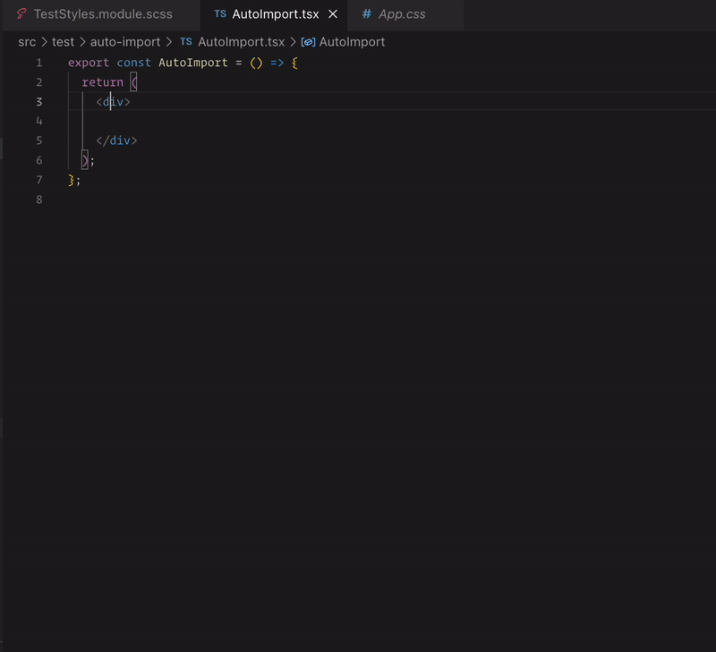
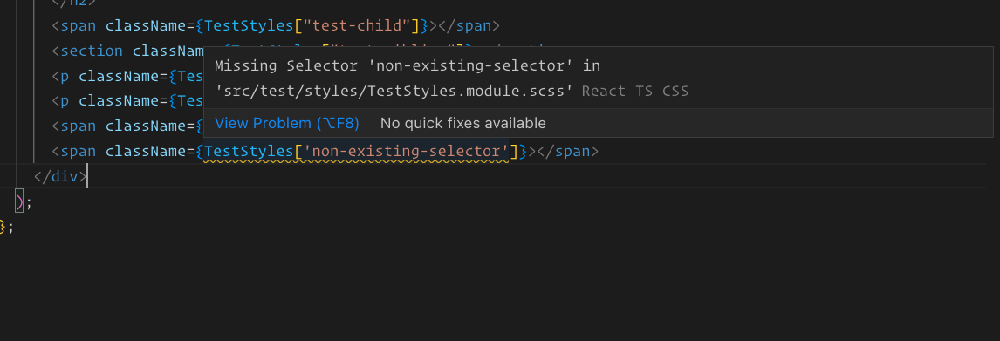
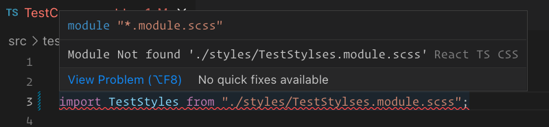

# React CSS modules

  


VS Code extenstion that enables  CSS modules intellisense for your React projects written in typescript.

Currently supports CSS and SCSS modules with the following capabilities

> This extension is uniuque interms of support for major types of [Casings](#casings)
> 
> Different types of selectors are supported which are not support by most of the other extensions in matketplace
> - Root selectors
> - Nested Selectors
> - Suffixed Selectors([scss only](https://sass-lang.com/documentation/style-rules/parent-selector#adding-suffixes))
### [Definitions](https://code.visualstudio.com/api/references/vscode-api#DefinitionProvider)
Go to any type of selector definition from your React Components
  
  

### [Hover](https://code.visualstudio.com/api/references/vscode-api#HoverProvider)
  Peek CSS properties of a selector on hover
  
  

  


### [Completions](https://code.visualstudio.com/api/references/vscode-api#HoverProvider)

  - Completion of selectors 
  
  

  - Completion of style identifiers with automatic import of closest (s)css module
  
  

### [Diagnostics](https://microsoft.github.io/language-server-protocol/specifications/lsp/3.17/specification/#diagnostic)
  
  - Useful diagnostics information are provided for missing selector
  - Module not found error is also provided for non existing css modules
  - 
  - Settings to change diagnostics
    - `reactTsCSS.diagnostics` - Toggle to turn off diagnostics
    - `reactTsScss.tsconfig` - Base TS Config path in the project.Useful for resolving path aliases. Defaults to './tsconfig.json'
    - `reactTsScss.baseDir` - Root directory of your project. Useful if tsconfig doesn't have information about path aliases.Defaults to 'src'

### [Code Actions](https://code.visualstudio.com/docs/editor/refactoring#_code-actions-quick-fixes-and-refactorings)
 -


## Casings 
This extensions supports selectors written in 
1. snake_case
2. camelCase 
3. kebab-case

## Settings

Defaults

```json
{
  "reactTsCSS.peek": true, // Hover
  "reactTsCSS.autoComplete": true, // Completion
  "reactTsCSS.autoImport": true, // Auto import modules
  "reactTsCSS.definition": true, // Definition
  "reactTsCSS.tsconfig":"./tsconfig.json", // TS config path in workspace
  "reactTsCSS.baseDir":"src", // Root directory of your application
  "reactTsCSS.diagnostics":true, // Diagnostics
}
```

## Current Feasibilities

1. This extension supports only on typescript react projects using CSS/SCSS modules.
2. In order for the features to work smoothly, the selectors must have a reference to a CSS module.
3. The extension provides intellisense  for
   - Nested selectors
   - Sibling selectors
   - [Suffix Selectors](https://sass-lang.com/documentation/style-rules/parent-selector#adding-suffixes)
4. ~~Cyclic dependencies are also resolved and selectors are added recursively~~
   - ~~for instance if a `SCSSModule` includes selectors from a normal sass file (using `@import` or `@use` rules) , those selectors can be accessed by the extension~~

## RoadMap

1. Plain selectors without any reference is a `no op` in the current version and is expected to be added in coming versions
2. Current support is limited to typescript and typescript react. JSX support is considered for upcoming releases
3. Support for less and stylus will be added in the future versions
4. [Reference provider](https://code.visualstudio.com/api/references/vscode-api#ReferenceProvider) - Find all references of a selector from inside a css module
5. [Rename Provider](https://code.visualstudio.com/api/references/vscode-api#RenameProvider) - Rename a selector and get all the places updated
6. Code Actions for Diagnostics
